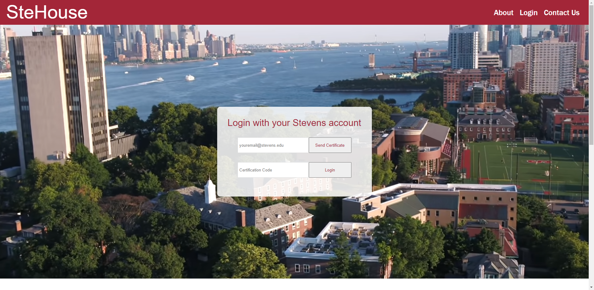
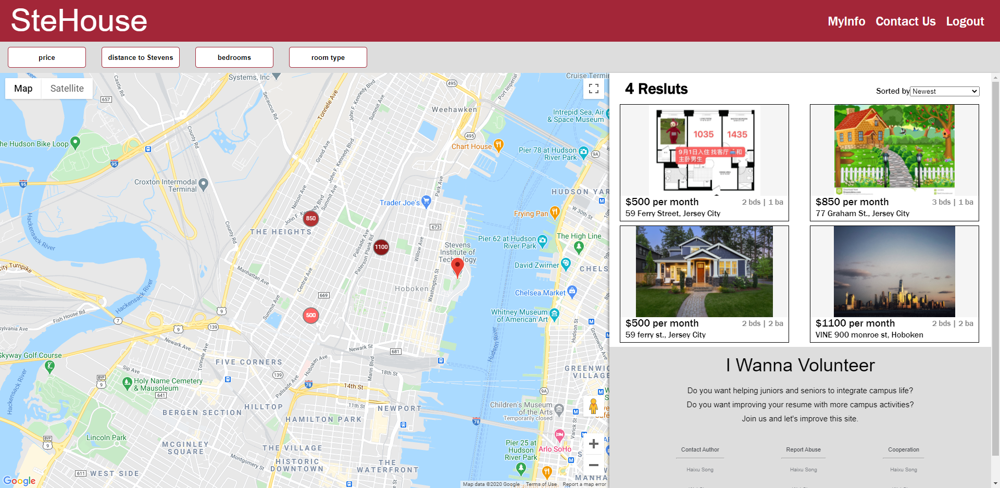
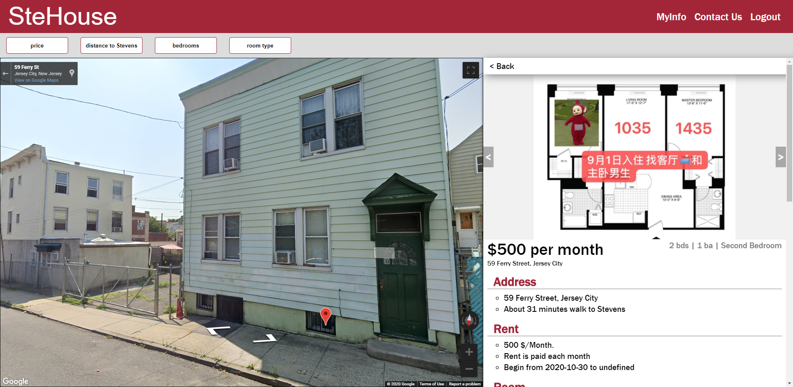
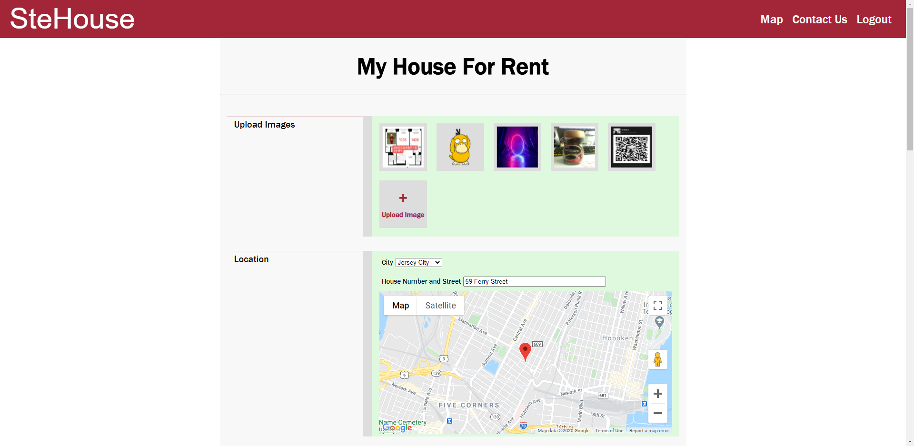

# SteHouse

## Introduction

A simple web app project developed for Stevens international students to help them rent house or room around Stevens. Only students with Stevens email can login so that there's no middleman. The website don't provide transaction service, just offering information as a platform. Trust are built within alumnus.

## Snap-shots

## Techniques

* Front-end:
  * react: a popular declarative, component-based js library to build user interfaces.
  * sass: a popular css extention language that makes css faster to develope
  * react-router-dom: a react version of front-end router
  * react-redux: a react version redux, managing state among components
  * browser-image-compression: a library used to compress the size and quality of pictures, I use it to reduce the server and db pressure.
  * axios: a popular ajax library using Promise. 
  * @react-google-maps/api: a react version google map api components, there's few bugs init.

* Back-end:
  * express: a popular nodejs server
  * express-session: express version server session middleware
  * axios: a popular ajax library using Promise
  * body-parser: express middleware used to parse request data parameters
  * multiparty: a library to parse form request parameters
  * nodemailer: nodejs library to send emails

* Database
  * mongodb: a popular non-relational database
  * mongoose: nodejs api of mongodb
  * connect-mongo: express-session store for mongodb, it''s used to store the session 
* Deployment
  * AWS ES2 Ubuntu: FREE 12 months. wohooooooooo
  * OpenSSH: Remote connect and operate Ubuntu
  * Git: transfer secured public code and version control.
  * pm2: nodejs popular process manager, I used it to host the server.
  * Nginx: a popular reverse proxy server.

## Git Branches

* master: working directory
* static-version: tested online version with big improvement like v1.2
* latest-version: latest small versions with bug fixing like v1.1.1

## Website

www.stehouse.info

## Log

#### 10/31/2020: v1.0.0

* Web App basic functional interface online.

#### 10/31/2020: v1.0.1

* Set Google Map key safer
* Set AWS security groups safer
* Set server cross-region safer
* Brand new favicon

